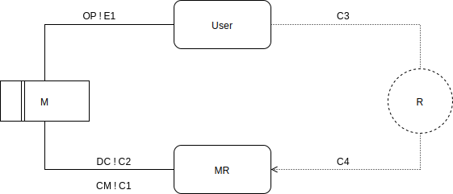

# Ejercicio 1

## Cajero automático

El problema puede separarse en varias partes, de las cuales nosotros vamos a elegir dos, ya que es lo que nos pareció más razonable.


### Consultar saldo
#### 1)
Usando el patrón de análisis information display pudimos encontrar estos fenómenos de ambiente, máquina y compartidos:

| Ambiente | Máquina  | Compartido |
|----------|----------|------------|
| Presionar boton de consultar saldo | Variable P de consultar saldo | P <--> Mostrar saldo en el display |

#### 2)

En la tabla se observa claramente que el hecho de que se muestre el saldo en el display si bien se observa en el ambiente, es algo que controla la máquina a causa de una reacción al ambiente. 

### Retirar cantidad de dinero seleccionada
#### 1)

En esta parte usamos el patrón de análisis de commanded behavior.



```math
OP = { pedir x cantidad de dinero }
E1 = { se presionan botones para pedir dinero }
DC = { Poner x en la variable billetes_a_cargar, Poner la variable cargando_billetes en 1 }
C2 = { Cargar los billetes, Abrir compuerta }
CM = { Cerrar compuerta }
C1 = { Poner variable de cargando_billetes en 0, Poner variable de billetes_a_cargar en 0 }
C3 = { Retirar x dinero }
C4 = { Sale x cantidad de plata de la ranura }
```

Teniendo en cuenta el diagrama y el significado de las interfaces, decimos que E1, C2, DC y CM y C4 son compartidos.

#### 2)

E1 es controlado por el ambiente, mientras que DC es controlado por la maquina (en reaccion a E1). Siguiendo el mismo razonamiento, CM es controlado por la maquina en reaccion a C2. Finalmente C4 es controlado por la máquina.

# Ejercicio 2
## Microondas

En este ejercicio vamos a hacer también la separación en el análisis, pero no la vamos a desarrollar, ya que no es parte del ejercicio.


#### 1)

| Ambiente | Máquina  | Compartido |
|----------|----------|------------|
| Intensidad de coccion asociado a potencia indicada al magnetron | Potencia :: Alto \| Medio \| Bajo | Potencia magnetron <--> Variable Potencia |
| El usuario toca iniciar | PuertaAbierta :: Boolean | El magnetron genera ondas => ¬PuertaAbierta ^ El usuario toco iniciar   |
| Giro del plato vinculado a la func del motor | Motor :: Off \| 1 \| 2 \| 3  | Giro del plato <-> Motor >= 1 |
| Estado de la lampara interna en funcion del sensor de la puerta | Lampara :: Boolean | PuertaAbierta => Lampara |
| La puerta está abierta/cerrada | PuertaAbierta :: Boolean | Puerta abierta/cerrada <--> PuertaAbierta = True \| False |
| El display vinculado al tiempo que lleva encendido el motor | CookTime :: NonNegInteger | Display muestra x <-> CookTime = x |

#### 2)

La potencia del magnetrón es controlada por el ambiente ya que la variable está ligada al potenciómetro físico.
El giro del plato es controlado por la máquina como una reacción al fenómeno del ambiente en el que se toca el botón de iniciar.
El estado de la lampara es un fenómeno controlado por el ambiente, dado que está ligado enteramente con el estado de la puerta.
El display es controlado por la máquina dado que está ligado claramente a la variable CookTime.

#### 3)

Sin ser extensivos, los requerimientos básicos que pudimos pensar son los siguientes:

* La potencia a la que se somete lo ingresado en el microondas es exactamente la seleccionada en el potenciómetro.
* El motor y la potencia estan apagados siempre que la puerta esté abierta
* El boton iniciar solo tiene efecto cuando la puerta está cerrada
* Los botones del panel frontal para aumentar el tiempo se deben reflejar en el display