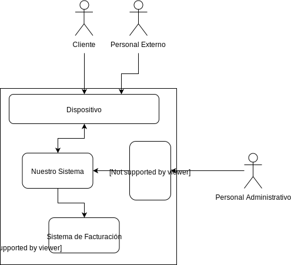

# Trabajo práctico 3

## Sistema de cobro por tarjeta NFC
--------
### Nuestro Cliente

Hoteles Pepito es una cadena de hoteles que quiere implementar un sistema de manejo de servicios en el cual sus clientes puedan elegir qué servicios utilizar y luego reciban una factura acorde de forma sencilla y rápida. 

### Glosario

Estos términos se utilizarán a lo largo del documento de ahora en más refiriendosé a su respectiva definición a menos que se aclare lo contrario.


|**Término** | **Definición** |
|:-----------|:---------------|
|Reserva|El proceso que permite a un cliente reservar en qué habitación quiere hospedarse y cuanto tiempo|
|Cliente|El cliente del hotel cuyo objetivo es pasar cierto          tiempo en el mismo|
|Cliente titular|El dueño de la reserva|
|Usuario|Se usa como sinónimo de cliente|
|Dispositivo|Aparato que se encargará de leer las tarjetas|
|Personal administrativo|Empleados del hotel cuya función es atender a los clientes|
|Servicio|Lo que ofrece el hotel que se debe acceder mediante el uso de las tarjetas|
|Tarjeta|Tarjeta NFC, el elemento que tendran los clientes para utilizar los servicios|
|Personal externo|Personas que deben entrar al establecimiento para realizar tareas por ejemplo de mantenimiento, etc|
|Tarjeta en Blanco|Tarjeta que no tiene relacionado ningún Cliente|

#### Requerimientos de negocio

##### Contexto

Hoteles Pepito, tiene los siguientes servicios adicionales al hospedaje:

1) Gimnasio
2) Pileta
3) Jacuzzi
4) Bar
5) Salon de Juegos
6) Heladera
7) Caja Fuerte
8) Sauna
9) Spa
10) Restaurante

Cada uno de estos servicios se cobra a parte del precio del hospedaje, lo que quiere decir que si uno pide una habitación con _3_ y _7_, al final de la estadía deberá pagar la suma de los precios del hospedaje, del jacuzzi y de la caja fuerte, lo haya usado o no. Hay algunos de estos servicios que están fuera de las habitaciones, y para usarlos, los huespedes tienen que pedir unas credenciales al personal administrativo. De esta forma se lleva un registro de los servicios que usó cada huesped para realizar la facturación al final de la estancia. Todo esto se hace mediante un sistema de facturación que recibe _eventos_ (i.e., "el huesped X pidió usar el gimnasio", "el huesped X pidió usar el Salón de Juegos", etc) que son ingresados manualmente (es decir, hay una intervención humana) por el personal administrativo mediante una aplicación que envia estos eventos en un formato en particular (explicado más adelante) al sistema de facturación para que efectue la factura.

##### Oportunidad de negocio, criterios de éxito, y necesidades del mercado.

Según Hoteles Pepito, los clientes están satisfechos con la idea de pagar por lo que usan en cuanto a los servicios que estan afuera de las habitaciones, no así con pagar todo lo que tenga la habitación. Por otro lado, los clientes también acusan que tener que ir hasta la sala de entrada a pedir credenciales por un servicio es un tanto molesto a pesar de las ventajas antes mencionadas.

Por este motivo, Hoteles Pepito quiere ofrecerles a sus clientes una forma mejor y más personalizada de gestionar sus gastos, sin generarles tantas molestias.

En pocas palabras, las necesidades del mercado y el criterio de éxito yacen en que los clientes de Hoteles Pepito puedan tener más libertad a la hora de utilizar los servicios.

Para llevar a cabo este proyecto, Hoteles Pepito nos ha contratado así como a otras empresas para implementar una idea de cobro utilizando tarjetas NFC. Se sabe que habrá un tercero que se encargará de colocar unos dispositivos de su fabricación en los hoteles, cuya finalidad es proveer la funcionalidad de poder apoyar las tarjetas en pos de obtener cierto servicio. Los tipos de dispositivos que habrán serán:

* Molinete
  * Se apoya la tarjeta para entrar (ver sección de dispositivos para ver cuando se abre y cuando no)
  * Para salir está siempre destrabado
* Cerradura
  * Un dispositivo que abre una cerradura cuando se apoya la tarjeta magnética (ver sección de dispositivos para ver cuando se abre y cuando no)
  * Cuando la puerta o cerradura se vuelve a cerrar hay que apoyar denuevo la tarjeta para abrirla
* Dispositivo general
  * No se tiene mucha información al respecto de estos dispositivos, pero si sobre su funcionamiento: son todos parecidos a la cerradura, al acercarse la tarjeta hacen una accion basandosé en la respuesta obtenida (ver sección de dispositivos para ver cuando se abre y cuando no).
* Grabador
  * Servirá para grabar datos en la tarjeta: grabar qué usuario la tiene, grabar si fue devuelta (borrarle lo antes grabado), etc.


Nuestro software debería interactuar con estos dispositivos para generar el reporte esperado por el sistema de facturación de forma tal que al final de la estadía de cada cliente se le cobre lo correspondiente.

Las interacciones del sistema al final del desarrollo serían las siguientes:



La única interaccion de los clientes con el sistema general es a travez de los dispositivos, con sus respectivas tarjetas. En cuanto a nuestra incunvencia, los actores son los dispositivos, y el personal administrativo, siendo su función la de escribir las tarjetas (a travez del dispositivo grabador de tarjetas). El dispositivo grabador de tarjetas, es un actor que le dará a nuestro sistema los datos necesarios para saber qué cliente es el que tiene esa tarjeta.


#### Casos de uso

En esta sección revisaremos los casos de uso de los actores humanos en el sistema en general como para tener un mayor entendimiento de qué debe hacer el sistema.

##### Personal Administrativo


---
* Relacionar un usuario con una tarjeta:

**Brebe descripción**: Uno o varios clientes o alguien del personal externo se presentan en la entrada para hacer check in. El personal administrativo chequea en uno de los sistemas existentes la reserva y en caso de que está todo bien, procede a darle/s la/s tarjeta/s o que el personal externo esté anunciado.

**Paso a paso**
Previo a esto, el personal administrativo deberá buscar en el otro sistema los datos de todos los clientes a ingresar (i.e., user_id)

1) El personal administrativo agarra una tarjeta en blanco de la caja de tarjetas en blanco (se supone que habrán las suficientes siempre para los clientes y personal externo), por cada uno de los clientes.
   1) En el caso de personal externo se pondrá _user_id_ = INF, _room_id_ = 0, dandolé así la facultad de abrir cualquier dispositivo de molinete. En caso de que el personal externo deba entrar a una abitación, se le puede asignar esa habitación. El usuario INF no computará ningun gasto (esto ya está implementado en el sistema de facturación existente).
2) La apoya en el dispositivo grabador de tarjeta, escribe en el display del mismo el _user_id_ y el _room_id_ correspondientes, espera la confirmación de grabación.
3) Corrobora en la pantalla de clientes de nuestro sistema que el cliente con el _user_id_ tenga grabada la tarjeta y la habitación correspondiente.
4) Entrega la tarjeta al cliente.
---
* Volver una tarjeta al estado original:

**Brebe descripción**: Uno o varios clientes se presentan en la entrada para hacer check out. El personal administrativo chequea que todas las tarjetas entregadas al cliente sean devueltas para finalmente volver a dejarlas en blanco.

**Paso a paso**

1) El personal administrativo chequea en la pantalla de clientes de nuestro sistema que todas las tarjetas asociadas al id de usuario fueron devueltas.
2) Si fueron devueltas:
   1) Procede a poner cada tarjeta en el dispositivo grabador
   2) Selecciona en sus opciones borrar datos
   3) Corrobora en el sistema que efectivamente se borraron las tarjetas de los usuarios
3) Sino:
   1) Se les exigirá a los usuarios que entreguen todas las tarjetas dadas
   2) En caso de que reporten tarjetas perdidas, el personal administrativo las invalidará desde nuestro sistema (utilizando la pantalla de clientes), de forma tal que nadie más la pueda usar aunque la tarjeta tenga grabados los datos de antes.
   3) El cliente tendrá que pagar todos los gastos que se hicieron entre las tarjetas incluyendo los de la tarjeta perdida. Esto solo es un problema si los clientes se demoran en reportar la pérdida.
---
* Cobrar a un Cliente:
Todas las tarjetas deberían haber sido devueltas o declaradas perdidas para llegar a este paso.


**Brebe descripción**: El personal administrativo pasa a realizar el cobro.

**Paso a paso**

1) El personal administrativo elige el _user_id_ a generarle la factura. El programa interactúa con nuestro sistema para obtener todos los eventos generados en lugar de que el personal administrativo tenga que cargarlos a mano.
2) El personal administrativo presiona _Generar Factura_
3) Se envían los eventos en el mismo formato que antes
4) Se genera la factura
5) Se procede a cobrar como se hacía antes

##### Cliente
En esta sección se explicarán algunos de los casos de uso del cliente ya que en general son todos muy parecidos salvo por los diferentes tipos que se explican luego (i.e., Cerrojo, General, Molinete)


---
* Entrar a la habitación:
Para llegar acá el/los cliente/s debería/n haber pasado antes por el check-in antes explicado.


**Brebe descripción**: El/Los clientes están en la entrada de su habitación y quieren entrar.

**Paso a paso**

1) El cliente apoya la tarjeta en el lector que está en el cerrojo.
2) Si la habitación es la correcta:
   1) La puerta se abre
   2) Ingresa, cierra la puerta (por dentro tiene picaporte asi que se puede abrir sin necesidad de tener la tarjeta)
3) Sino
   1) La puerta no se abre
---
* Entrar al jacuzzi:
Para llegar acá el/los cliente/s debería/n haber pasado antes por el check-in antes explicado y haber entrado a la habitación (en Hoteles Pepito, los jacuzzis están dentro de la habitación).


**Brebe descripción**: El/Los clientes están en la entrada del jacuzzi y quieren entrar.

**Paso a paso**

1) El cliente apoya la tarjeta en el lector que está en el cerrojo del jacuzzi.
2) Si la habitación es la correcta:
   1) La puerta se abre
   2) Ingresa, cierra la puerta (por dentro tiene picaporte asi que se puede abrir sin necesidad de tener la tarjeta)
3) Sino
   1) La puerta no se abre
---
* Comer en restaurante:
Para llegar acá el/los cliente/s debería/n haber pasado antes por el check-in antes explicado.


**Brebe descripción**: El/Los clientes van a comer a un restaurante. En hoteles pepito los Restaurantes son tenedores libres en donde cada uno se sirve lo que quiere, teniendo que apoyar la tarjeta en los lectores de cada seccion (e.g., pollo, salsas, etc)

**Paso a paso**
Por cada plato de comida que quiera el cliente deberá:

1) Apoyar la tarjeta para abrir la vitrina del plato
2) Si la tarjeta no es blanca
   1) La vitrina se abre para que el cliente pueda sacar el plato
3) Sino
   1) La vitrina no se abre
---
* Entrar a la pileta por molinete:
Para llegar acá el/los cliente/s debería/n haber pasado antes por el check-in antes explicado.


**Brebe descripción**: El cliente va a la pileta, por lo que tiene que pasar por un molinete.

**Paso a paso**

1) Apoyar la tarjeta en el lector del molinete
2) Si la tarjeta no es blanca
   1) El molinete se habilita para que el cliente pueda pasar (cuando sale, se sale por el mismo lugar, el molinete siempre está habilitado para salir, no es necesario apoyar deunevo la tarjeta)
3) Sino
   1) El molinete no se habilita

---
* Abrir Caja Fuerte:
Para llegar acá el/los cliente/s debería/n haber pasado antes por el check-in antes explicado y haber entrado a su habitación. En Hoteles Pepito, las cajas fuertes están dentro de las habitaciones.


**Brebe descripción**: El cliente quiere abrir la caja fuerte de su habitación.

**Paso a paso**

1) Apoyar la tarjeta en el lector del cerrojo de la Caja Fuerte.
2) Si la tarjeta no es blanca y la habitación es la correspondiente tanto como el usuario.
   1) Se abre la caja fuerte
3) Sino
   1) No se abre
---
**Aclaraciones**:
Todas las tarjetas de los clientes asociados al mismo _user_id_ pueden hacer lo mismo. Es decir, no hay ninguna tarjeta que dado un _user_id_ pueda hacer más cosas que otra tarjeta con el mismo _user_id_.
Notar que el spa y el sauna funcionan igual que la pileta (por molinete). El gimnasio, el bar, y el salon de juegos funcionan igual que el restaurante (por diferentes dispositivos, no tienen molinete). El resto son cerrojos que se abren con la tarjeta.

### Alcance

El alcance, será el de desarrollar un sistema capaz de interactuar con unos _dispositivos_ que permiten actuar de cierta forma (e.g., abrir una cerradura, habiiltar un molinete, etc), que serán instalados por un tercero. Estos dispositivos permitiran a los clientes de los hoteles, elegir libremente qué usar y qué no. Es importante aclarar que los dispositivos estarán estratégicamente colocados en lugares para que la única forma de acceder a los servicios sea usando una tarjeta, pero que como esto es imposible fisicamente para algunos lugares como por ejemplo la pileta tambien es posible que muchos servicios puedan ser accedidos de otras maneras. Según hoteles Pepito, estarán contratando una empresa de seguridad para evitar esto mismo.

Este sistema deberá poder leer los datos enviados por los dispositivos al ser apoyada una tarjeta, y registrarlos de forma tal que cuando el personal administrativo lo requiera se puedan enviar los eventos al sistema de facturación existente para generar la factura.

Como dato de no mernor importancia, es importante que el sistema soporte que hayan varias tarjetas con el mismo _ID_ de cliente, dado que Hoteles Pepito pidió que cada huesped mayor de edad tenga una tarjeta al ingresar.

Sera parte del alcance del sistema los siguientes puntos:

* Facilitar el cobro de los gastos del usuario llevando un registro de los mismos
  * Llevar un registro de los eventos generados con dichas tarjetas
* Contar con una interfaz que permita integrarlo en otros sitemas ya existentes:
  * Enviarle los eventos generados al sistema de facturación cuando sea requerido
  * Leer los eventos que nos llegarían de los eventos para poder registrarlos 
* Hacer una UI para permitirle al personal administrativo del hotel utilizar los eventos generados por nuestro sistema para cobrar utilizando el otro sistema.
<!-- * Permitirle a los administradores acceder a graficos de uso y analytics -->

No es parte del alcance del sistema los siguietes puntos:

* Implementar un subsistema de facturación
* Implementar un sistema de reservas y gestion hotelera
* Instalar dispositivos de ningún tipo
* Calcular los gastos de los usuarios en base a los eventos

#### Breve explicación de como deberá funcionar cada servicio

* Servicios cuya entrada se cobra: Tiene varios molinetes en las entradas, los cuales deberan ser habilitados con las tarjetas para entrar. Si los usuarios entran y no les gusta se les cobra igual.
  * Pileta
  * Sauna
  * Spa
* Servicios cuyos gastos dependientes del consumo
  * Restaurante: No hay molinete, se entra libremente. Es como un tenedor libre, la gente se sirve lo que quiere, pero para abrir las diferentes vitrinas (por ejemplo la del pollo) tienen que pasar la tarjeta. Es cierto que cuando hacen esto pueden retirar más de un alimento, pero habrá personal que esté cuidando que esto no pase.
  * Bar: similar al restaurante pero con las bebidas
  * Salon de Juegos: similar al restaurante pero con los juegos, por ejemplo para jugar al Metal Slug hay que poner la tarjeta. Todos los juegos son de consola Atari por el momento.
  * Gimnasio
* Servicios de habitación: solo tienen una cerradura para entrar la cual se abre con la tarjeta.
  * Jacuzzi
  * Heladera
  * Caja Fuerte
  * Puerta de la habitación


### Contexto del Software a construir

#### Sistemas con los que el software debe interactuar

1) Sistema de facturación
2) Dispositivos
  
En cuanto al sistema de facturación, la interacción que se tendrá que cumplir es la de enviarle la lista de eventos de un usuario para generar la factura a:

```javascript
POST <url_del_sistema_de_facturacion>/facturar/:user_id
[
  $event_1$,
  $event_2$,
  .,
  .,
  .,
  $event_n$
]
```

donde cada evento es de la forma:

```javascript
{
  "event_id": <event_id>,
  "user_id": <user_id>,
  "timestamp": <timestamp>
}
```

y significa que el usuario con <user_id> hizo el <event_id> en <timestamp> que podría ser por ejemplo: _Abrir caja fuerte_. 

Es importante mencionar que estos event_id ya existen en el sistema de facturación, de hecho son los que se usan actualmente para generar la factura.

En el caso de la interacción con los _dispositivos_, consiste en la suscripción a los eventos generados via callback. Es decir que la interacción es la misma tanto para la Caja Fuerte como para el resto de los servicios. En cuanto a la repetición de los eventos, es fundamental que se guarden absolutamente todos los eventos generados, ya que es responsabilidad del sistema de facturación saber si hay que cobrar o no por dos pasadas de tarjeta consecutivas, etc. Por ejemplo, si se abre la caja fuerte 4 veces con 2 tarjetas de diferentes individuos en un mismo día, el sistema de facturación recibirá los 4 eventos distintos pero cobrará una sola vez. La otra interacción con los actores es la de asignarles el evento que tienen que mandar en las callbacks. Por último, todos los dispositivos reportan solo 1 evento que se dispara cuando se apoya la tarjeta.

#### Fenómenos del domínio

Principalmente podemos nombrar tres:

* Perdida de tarjeta

En caso de que se pierda una tarjeta, el cliente deberá reportarlo al personal administrativo, cuya función será dar de baja la misma en nuestro abm y darle una nueva tarjeta al cliente. Por otro lado, el cliente recibirá una "multa" que tendrá que pagar por fuera de nuestro sistema.

* Personal no cliente

Es importante mencionar que hay super-usuarios a los que el sistema de facturación no les genera ningún cobro aunque reciba eventos. Estos usuarios son los que se usarán para cargar las tarjetas para el personal de mantenimiento y cualquier entrada externa al flujo normal del hotel.

* Salteo de servicio con tarjeta

Por ejemplo, cuando un usuario salta un molinete para no pasar la tarjeta, o cuando fuerza una cerradura o algo así tambien para no pasar la misma. En estos casos, cuando son detectados, simplemente se le saca (se da de baja) la tarjeta a el y a todos los clientes de su grupo (es decir todas las tarjetas con ese user_id) para luego hecharlos del hotel cobrandoles una multa a decidir en el momento.

#### Funcionamiento de los dispositivos

Todos los dispositivos actores tienen el mismo funcionamiento: Leen una tarjeta, emiten el evento en el callback, esperan ack y actuan segun la respuesta:


Todos los eventos generados son de la siguiente forma:
```javascript
{
  "device_id": string,
  "card_id": string,
  "timestamp": int,
  "ack_url": string
}
```
#### Roles de los actores humanos en el sistema

|Rol| |
|Personal administrativo||
La respuesta esperada en __ack_url__ es de la siguiente forma:

```javascript
POST <ack_url>
{
  "result": boolean
}
```

donde result debe ser _true_ en caso de que se quiera dejar pasar o false en el caso contrario.

### Especificaciones

#### Requerimiento 1

Es necesario que se pueda asociar un ID de usuario con una/varias tarjetas, para poder darselas a los huespedes que cumplan las condiciones. Así como tambien entender que los usuarios y las tarjetas pueden estar relacionados solo con una habitación.


##### Especificación

El sistema externo con el que Hoteles Pepito hará la grabación de las tarjetas para habilitarlas para el uso de las habitaciones provee un sistema de callbacks REST para que otros servicios consuman los cambios de las tarjetas:

* **POST /subscribe**

body:
```javascript
{
  "callback_url": string
}
```


El callback a recibir en callback_url es:

* **POST callback_url**
```javascript
{
  "card_id": string,
  "user_id": string,
  "room_id": string
}
```

Donde _card\_id_ es el id de la tarjeta siendo grabada, _user\_id_ y _room\_id_ son los ids de usuario y habitación respectivamente. En el caso de que la tarjeta esté siendo grabada al estado inicial (en el cual no abre ninguna puerta ni tiene ningún efecto con ningún actor), user_id y room_id son null.

En este marco, nuestro sistema deberá implementar este endpoint que usaremos para recibir el callback:

* La url estará en /register
* Se debe actualizar/crear la información enviada por el sistema externo en una base de datos (MongoDB) con el siguiente formato
```javascript
// user
{
  id: user_id,
  cards: [string],
  room_id: string
}
```

* Los status code a utilizar se encuentra en el RFC HTTP 1.1

Notar que si el usuario aún no está registrado en nuestro sistema, habrá que crearlo. Pero en el caso de que ya esté creado simplemente se actualizará la información agregandolé una tarjeta a su lista de tarjetas y cambiando el room_id si es necesario.

Por otro lado, si _user\_id_ = null habrá que eliminar la tarjeta del usuario que la tenga.


#### Requerimiento 2

Al "pasar" la tarjeta por el dispositivo asociado a un servicio, se quiere que se agregue el evento de uso del servicio a la lista de eventos generados por el usuario de la tarjeta.

##### Especificación

Los aparatos que se colocarán tienen también un sistema de callbacks REST para notificar los eventos. En este contexto el sistema tiene que poder relacionar una señal de un dispositivo en particular y una tarjeta de forma tal que según el dispositivo se sabe que evento es y cual fué el usuario que lo activó. Por ejemplo: el dispositivo con id _hfx43_ que es el que abre el molinete a la Pileta envía un callback que dice que se acercó la tarjeta _v4y_. En este caso el sistema debe saber que el dispositifo _hfx43_ está relacionado con el evento "el usuario que tiene la tarjeta _v4y_ entró a la pileta".

Más especificamente, la estructura del callback que mandan los dispositivos es de la siguiente forma

**Evento triggereado**:
```javascript
{
  "device_id": string,
  "card_id": string,
  "timestamp": int,
  "ack_url": string
}
```

Con estos eventos el sistéma deberá saber a qué evento está relacionado el _device\_id_ y generarseló al usuario que tenga la tarjeta con _card\_id_ para que luego los administradores puedan cobrar por los eventos generados de como lo hacían antes.

Por otro lado, es necesario que los administradores tengan la posibilidad de decir qué eventos dispara cada dispositivo, lo cual puede cambiar con el tiempo, por lo que ellos tambien deberían poder cambiarlos en el sistema:


Para resolver esto, el sistema deberá tener una **base de datos** que permita saber dado un device_id qué evento está relacionado. No es necesario que sea una base de datos relacional ni que sea eficiente pero de todas formas el diagrama de para explicar esta relación sería:


Los posibles eventos que espera el servicio externo son de la siguiente forma (sus ids deberán ser consultados en el manual de eventos del software de facturación):

```javascript
{
  "event_id": string,
  "user_id": string,
  "timestamp": int
}
```

Finalmente, al recibir un evento, el sistemá deberá actualizar los eventos del usuario agregandole el evento correspondiente. Es imperativo que este proceso soporte la concurrencia ya que un mismo usuario puede generar dos eventos al mismo tiempo (e.g., dos miembros de la familia van a diferentes lados, uno a la pileta y el otro a abrir la heladera. En cuyo caso el resultado debería ser que ambos eventos se agregan a la lista de eventos del usuario). Por otro lado, es imperativo que se envíe el "ok" al dispositivo, haciendo una pegada a la url

```javascript
POST <ack_url>
{
  "result": boolean
}
```

que deberá ser true en caso de que se permita el acceso. O false en caso contrario.


#### Requerimiento 3

El personal administartivo tiene que poder obtener la lista de eventos de un usuario para poder emitir la facturación como lo hacía antes.

##### Especificación

Para lograr esto se reemplazará el pequeño software con el que antes los administradores cargaban los eventos manualmente a medida que los usuarios los iban generando, por un software que consultará nuestro sistema mediante su API REST para luego comunicarse con el sistema de facturación y generar la factura.

Teniendo en cuenta que el software que usaban antes no era más que un crud de eventos que se podía gestionar mediante una UI en la cual tambíen había un botón para generar la factura y que Hoteles Pepito nos permite modificarlo, lo que se deberá hacer será eliminar la parte en la que se generan eventos manualmente y hacer que el botón generar factura ahora busque los eventos en nuestro sistema

El sistema viejo se vé de la siguiente forma:


Luego de la modificación deberá verse:


Donde la diferencia fundamental yace en que **generar factura** antes buscaba en una base de datos los eventos previamente genrados, y ahora usará el resultado de

```javascript
GET /events?user=<user_id>
```

Luego deberá generar la factura como antes. Y finalmente marcará los eventos como pagados.

```javascript
PATCH /events?user=<user_id>
{
  "paid": true,
}
```
Será responsabilidad del personal administrativo desactivar todas las tarjetas del usuario cuando este se acerque a pagar. Es importante aclarar que si el personal administrativo no desactiva todas las tarjetas del usuario antes de generar la factura, es posible que se genere algun otro evento en el medio y que no sea cobrado.
<!--## Notas

 Describir los sistemas externos. todos
los que usan nuestro sistema (facturacion, gestion hotelera)
los que usamos para dar acceso a los servicios
como nos comunicamos con los servicios externos
en que formato y con que peculiaridades

Problema desde el POV del analista

Nuestro cliente tiene la necesidad de controlar, visualizar y analisar los datos de consumo de sus clientes, con el fin de poder cobrar lo justo y necesario que se gasto, poder luego hacer analytics y demas.

El sistema que se pide es simplemente una API, que provee los datos que otro sistema visualizara. Donde se visualiza, quienes lo pueden ver y demás es parte del scope del sistema externo.

* Al entrar al hotel se le da N tarjetas al usuario (1 por familiar mayor de edad), las cuales seran grabadas con un ID unico asociado al cliente, y un ID de habitación. Esta grabación se hara con un lectograbador NFC que posee el administrativo de atencion al usuario.
* Todas las tarjetas pueden acceder a todos los servicios del hotel
* Los servicios del hotel se pueden clasificar dependiendo de su ¿tiempo de uso?:
  * Servicios por dia
  * Servicios por uso de unica vez
* Los diferentes servicios pueden accederse de alguna de las siguientes maneras:
  * Acceso por puerta restringida -> La tarjeta se pasa por un lector que abre la puerta
  * Acceso por actuador ON/OFF -> La tarjeta se pasa por un lector que enciende el aparato
  * En cualquiera de esos casos, nuestro sistema le avisa al sistema externo que se debe desbloquear/encender. Nuestro sistema no sera el encargado de implementar la solucion de desbloquado/encendido.
* El sistema debe devolver los datos de eventos de consumición de servicio asociados a una tarjeta/cliente, va a esperar un ID del cliente, y devolver los datos que se encuentran en la base de datos.
* La tarjeta NFC solo va a guardar los datos de ID de tarjeta y habitación, sin guardar datos de cada una de las transacciones, sera solo utilizada como metodo identificatorio, y para poder guardar en la base de datos el consumo asociado al ID de la tarjeta, es decir, la tarjeta X consumio Y servicio a las Z horas.
  -->
