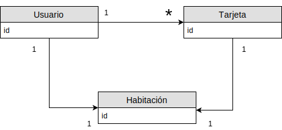
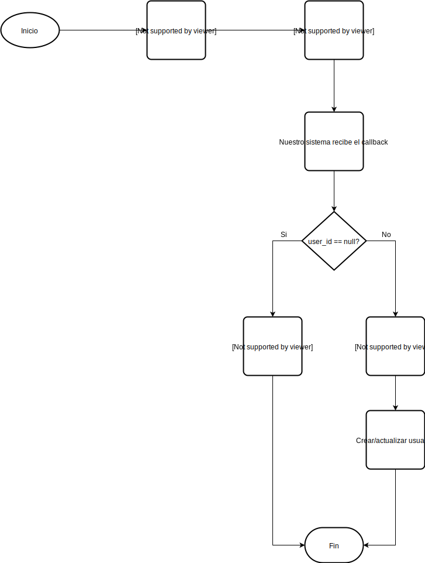
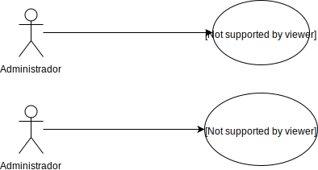
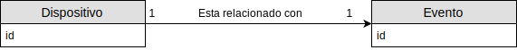
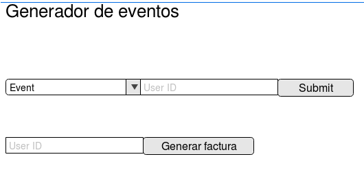
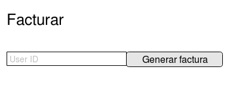

# Trabajo práctico 3

## Sistema de cobro por tarjeta NFC
--------
### Cliente

Hoteles Pepito es una cadena de hoteles que quiere implementar un sistema de manejo de servicios en el cual sus clientes puedan elegir qué servicios utilizar y luego reciban una factura acorde de forma sencilla y rápida. 

#### Requerimientos de negocio

##### Contexto

Hoteles Pepito, tiene los siguientes servicios adicionales al hospedaje:

1) Gimnasio
2) Pileta
3) Jacuzzi
4) Bar
5) Salon de Juegos
6) Heladera
7) Caja Fuerte
8) Sauna
9) Spa
10) Restaurante

Cada uno de estos servicios se cobra a parte del precio del hospedaje, lo que quiere decir que si uno pide una habitación con _3_ y _7_, al final de la estadía deberá pagar la suma de los precios del hospedaje, del jacuzzi y de la caja fuerte, lo haya usado o no. Hay algunos de estos servicios que están fuera de las habitaciones, y para usarlos, los huespedes tienen que pedir unas credenciales al personal administrativo. De esta forma se lleva un registro de los servicios que usó cada huesped para realizar la facturación al final de la estancia. Todo esto se hace mediante un sistema de facturación que recibe _eventos_ (i.e., "el huesped X pidió usar el gimnacio", "el huesped X pidió usar el Salón de Juegos", etc) que son ingresados manualmente (es decir, hay una intervención humana) por el personal administrativo, basandosé en los registros de gastos generados.

##### Oportunidad de negocio, criterios de éxito, y necesidades del mercado.

Segun Hoteles Pepito, los clientes están satisfechos con la idea de pagar por lo que usan en cuanto a los servicios que estan afuera de las habitaciones, no así con pagar todo lo que tenga la habitación. Por otro lado, los clientes también acusan que tener que ir hasta la sala de entrada a pedir credenciales por un servicio es un tanto molesto a pesar de las ventajas antes mencionadas.

Por este motivo, Hoteles Pepito quiere ofrecerles a sus clientes una forma mejor y más personalisada de gestionar sus gastos, sin generarles tantas molestias.

En pocas palabras, las necesidades del mercado y el criterio de éxito yacen en que los clientes de Hoteles Pepito puedan tener más libertad a la hora de utilizar los servicios.

### Alcance

El alcance, será el de desarrollar un sistema capaz de interactuar con unos _dispositivos_ que permiten actuar de cierta forma (e.g., abrir/cerrar una cerradura, habiiltar un molinete, etc), que serán instalados por un tercero. Estos dispositivos permitiran a los clientes de los hoteles, elegir libremente qué usar y qué no.

Este sistema deberá poder leer los datos enviados por los dispositivos al ser apoyada una tarjeta, y registrarlos de forma tal que cuando el personal administrativo lo requiera se puedan enviar los eventos al sistema de facturación existente para generar la factura.

Como dato de no mernor importancia, es importante que el sistema soporte que hayan varias tarjetas con el mismo _ID_ de cliente, dado que Hoteles Pepito pidió que cada huesped mayor de edad tenga una tarjeta al ingresar.

Sera parte del alcance del sistema los siguientes puntos:

* Facilitar el cobro de los gastos del usuario llevando un registro de los mismos
  * Llevar un registro de los eventos generados con dichas tarjetas
* Contar con una interfaz que permita integrarlo en otros sitemas ya existentes:
  * Enviarle los eventos generados al sistema de facturación cuando sea requerido
  * Leer los eventos que nos llegarían de los eventos para poder registrarlos 
* Hacer una UI para permitirle al personal administrativo del hotel utilizar los eventos generados por nuestro sistema para cobrar utilizando el otro sistema.
<!-- * Permitirle a los administradores acceder a graficos de uso y analytics -->

No es parte del alcance del sistema los siguietes puntos:

* Implementar un subsistema de facturación
* Implementar un sistema de reservas y gestion hotelera
* Instalar dispositivos de ningún tipo
* Calcular los gastos de los usuarios en base a los eventos

### Especificaciones

#### Requerimiento 1

Es necesario que se pueda asociar un ID de usuario con una/varias tarjetas, para poder darselas a los huespedes que cumplan las condiciones. Así como tambien entender que los usuarios y las tarjetas pueden estar relacionados solo con una habitación.



##### Especificación

El sistema externo con el que Hoteles Pepito hará la grabación de las tarjetas para habilitarlas para el uso de las habitaciones provee un sistema de callbacks REST para que otros servicios consuman los cambios de las tarjetas:

* **POST /subscribe**

body:
```javascript
{
  "callback_url": string
}
```


El callback a recibir en callback_url es:

* **POST callback_url**
```javascript
{
  "card_id": string,
  "user_id": string,
  "room_id": string
}
```

Donde _card\_id_ es el id de la tarjeta siendo grabada, _user\_id_ y _room\_id_ son los ids de usuario y habitación respectivamente. En el caso de que la tarjeta esté siendo grabada al estado inicial (en el cual no abre ninguna puerta ni tiene ningún efecto con ningún actor), user_id y room_id son null.

En este marco, nuestro sistema deberá implementar este endpoint que usaremos para recibir el callback:

* La url estará en /register
* Se debe actualizar/crear la información enviada por el sistema externo en una base de datos (MongoDB) con el siguiente formato
```javascript
// user
{
  id: user_id,
  cards: [string],
  room_id: string
}
```

* Los status code a utilizar se encuentra en el RFC HTTP 1.1

Notar que si el usuario aún no está registrado en nuestro sistema, habrá que crearlo. Pero en el caso de que ya esté creado simplemente se actualizará la información agregandolé una tarjeta a su lista de tarjetas y cambiando el room_id si es necesario.

Por otro lado, si _user\_id_ = null habrá que eliminar la tarjeta del usuario que la tenga.



#### Requerimiento 2

Al "pasar" la tarjeta por el dispositivo asociado a un servicio, se quiere que se agregue el evento de uso del servicio a la lista de eventos generados por el usuario de la tarjeta.

##### Especificación

Los aparatos que se colocarán tienen también un sistema de callbacks REST para notificar los eventos. En este contexto el sistema tiene que poder relacionar una señal de un dispositivo en particular y una tarjeta de forma tal que según el dispositivo se sabe que evento es y cual fué el usuario que lo activó. Por ejemplo: el dispositivo con id _hfx43_ que es el que abre el molinete a la Pileta envía un callback que dice que se acercó la tarjeta _v4y_. En este caso el sistema debe saber que el dispositifo _hfx43_ está relacionado con el evento "el usuario que tiene la tarjeta _v4y_ entró a la pileta".

Más especificamente, la estructura del callback que mandan los dispositivos es de la siguiente forma

**Evento triggereado**:
```javascript
{
  "device_id": string,
  "card_id": string,
  "timestamp": int
}
```

Con estos eventos el sistéma deberá saber a qué evento está relacionado el _device\_id_ y generarseló al usuario que tenga la tarjeta con _card\_id_ para que luego los administradores puedan cobrar por los eventos generados de como lo hacían antes.

Por otro lado, es necesario que los administradores tengan la posibilidad de decir qué eventos dispara cada dispositivo, lo cual puede cambiar con el tiempo, por lo que ellos tambien deberían poder cambiarlos en el sistema:



Para resolver esto, el sistema deberá tener una **base de datos** que permita saber dado un device_id qué evento está relacionado. No es necesario que sea una base de datos relacional ni que sea eficiente pero de todas formas el diagrama de para explicar esta relación sería:



Los posibles eventos que espera el servicio externo son de la siguiente forma (sus ids deberán ser consultados en el manual de eventos del software de facturación):

```javascript
{
  "event_id": string,
  "user_id": string,
  "timestamp": int
}
```

Finalmente, al recibir un evento, el sistemá deberá actualizar los eventos del usuario agregandole el evento correspondiente. Es imperativo que este proceso soporte la concurrencia ya que un mismo usuario puede generar dos eventos al mismo tiempo (e.g., dos miembros de la familia van a diferentes lados, uno a la pileta y el otro a abrir la heladera. En cuyo caso el resultado debería ser que ambos eventos se agregan a la lista de eventos del usuario).

#### Requerimiento 3

El personal administartivo tiene que poder obtener la lista de eventos de un usuario para poder emitir la facturación como lo hacía antes.

##### Especificación

Para lograr esto se reemplazará el pequeño software con el que antes los administradores cargaban los eventos manualmente a medida que los usuarios los iban generando, por un software que consultará nuestro sistema mediante su API REST para luego comunicarse con el sistema de facturación y generar la factura.

Teniendo en cuenta que el software que usaban antes no era más que un crud de eventos que se podía gestionar mediante una UI en la cual tambíen había un botón para generar la factura y que Hoteles Pepito nos permite modificarlo, lo que se deberá hacer será eliminar la parte en la que se generan eventos manualmente y hacer que el botón generar factura ahora busque los eventos en nuestro sistema

El sistema viejo se vé de la siguiente forma:



Luego de la modificación deberá verse:



Donde la diferencia fundamental yace en que **generar factura** antes buscaba en una base de datos los eventos previamente genrados, y ahora usará el resultado de

```javascript
GET /events?user=<user_id>
```

Luego deberá generar la factura como antes. Y finalmente marcará los eventos como pagados.

```javascript
PATH /events?user=<user_id>
{
  "paid": true,
}
```
Será responsabilidad del personal administrativo desactivar todas las tarjetas del usuario cuando este se acerque a pagar.
<!--## Notas

 Describir los sistemas externos. todos
los que usan nuestro sistema (facturacion, gestion hotelera)
los que usamos para dar acceso a los servicios
como nos comunicamos con los servicios externos
en que formato y con que peculiaridades

Problema desde el POV del analista

Nuestro cliente tiene la necesidad de controlar, visualizar y analisar los datos de consumo de sus clientes, con el fin de poder cobrar lo justo y necesario que se gasto, poder luego hacer analytics y demas.

El sistema que se pide es simplemente una API, que provee los datos que otro sistema visualizara. Donde se visualiza, quienes lo pueden ver y demás es parte del scope del sistema externo.

* Al entrar al hotel se le da N tarjetas al usuario (1 por familiar mayor de edad), las cuales seran grabadas con un ID unico asociado al cliente, y un ID de habitación. Esta grabación se hara con un lectograbador NFC que posee el administrativo de atencion al usuario.
* Todas las tarjetas pueden acceder a todos los servicios del hotel
* Los servicios del hotel se pueden clasificar dependiendo de su ¿tiempo de uso?:
  * Servicios por dia
  * Servicios por uso de unica vez
* Los diferentes servicios pueden accederse de alguna de las siguientes maneras:
  * Acceso por puerta restringida -> La tarjeta se pasa por un lector que abre la puerta
  * Acceso por actuador ON/OFF -> La tarjeta se pasa por un lector que enciende el aparato
  * En cualquiera de esos casos, nuestro sistema le avisa al sistema externo que se debe desbloquear/encender. Nuestro sistema no sera el encargado de implementar la solucion de desbloquado/encendido.
* El sistema debe devolver los datos de eventos de consumición de servicio asociados a una tarjeta/cliente, va a esperar un ID del cliente, y devolver los datos que se encuentran en la base de datos.
* La tarjeta NFC solo va a guardar los datos de ID de tarjeta y habitación, sin guardar datos de cada una de las transacciones, sera solo utilizada como metodo identificatorio, y para poder guardar en la base de datos el consumo asociado al ID de la tarjeta, es decir, la tarjeta X consumio Y servicio a las Z horas.
  -->
