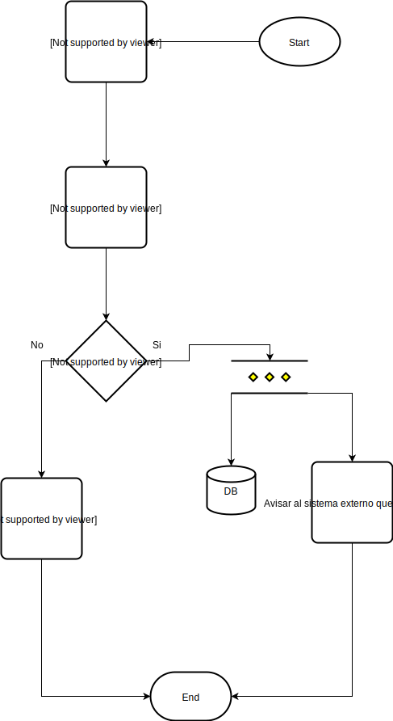
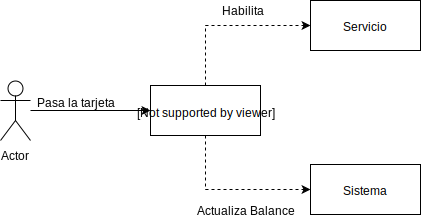
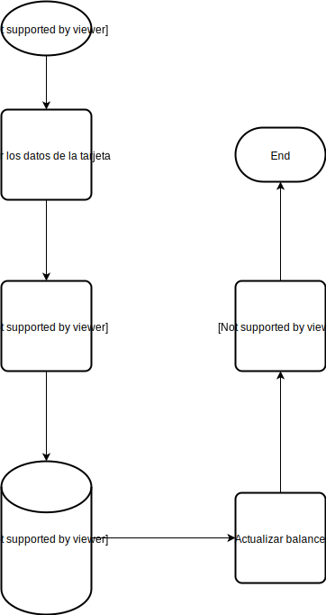
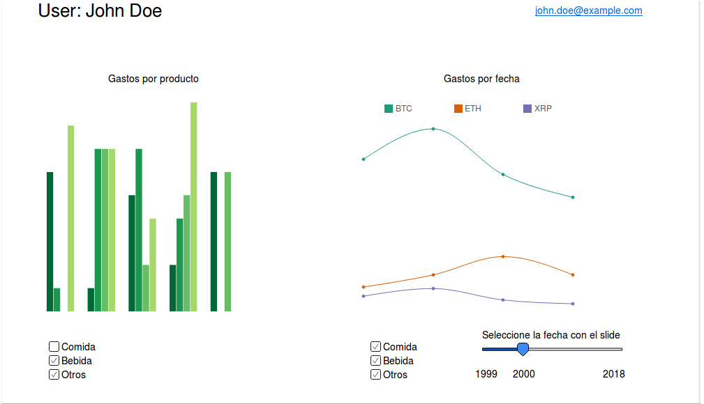

# Trabajo práctico 3

## Centralizar el sistema de pago de los hoteles
------
### Contexto

En el pasado semestre, particularmente durante la epoca de invierno, el equipo de marketing y logistica tuvieron el encargo de realizar encuestas a razon de adquirir, y analizar los diferentes comportamientos de los clientes. Dichas encuestas revelaron que los usuarios no confían en los sistemas de pagos que ofrecen los hoteles, y las razones son bastante variadas. Algunos de los ejemplos obtenidos son sistemas deficientes, sistemas con respuesta que tardan demasiado tiempo, etc. Por otro lado, uno de los servicios habituales que nuestra gama de hoteles suele manejar es la venta inmediata y/o diferida de paquetes turisticos,

Tabla de Tarifas Actual
|Servicio de hospedaje básico|Bar   |Jacuzzi|Heladera|Pileta Climatizada|Gimnasio
|:----:|:----:|:-----:|:---:|:---:|:---:|:---:
|300 u$s|10 u$s |35 u$s  |10 u$s|25 u$s|27 u$s

Paquetes
|Servicio de hospedaje básico|Bar   |Jacuzzi|Heladera|Pileta Climatizada|Gimnasio|Total
|:----:|:----:|:-----:|:---:|:---:|:---:|:---:|:---:
|X|X|O|X|O|O|275 u$s
|X|X|O|X|O|X|300 u$s
|X|X|O|X|X|X|325 u$s
|X|X|X|X|X|X|350 u$s

los cuales en un promedio elevado, los clientes aprovechan y obtienen de todas formas sin pagarlos (informacion vital que pudo obtenerse gracias al registro y rastreo de los mismos).

Si bien, se lleva utilizando el sistema actual durante un tiempo prolongado, tambien es de publico conocimiento que los avances tecnologicos actuales pueden beneficiar a la empresa de diferetes maneras. Nuestro principal objetivo a mediano/largo plazo es generar un sistema centralizado

Por este motivo, se quiere realizar un sistema que permita centralizar los metodos de pago, de forma tal que los clientes puedan confiar en que no les van a cobrar algo que no utilizaron además de que los hoteles también puedan confiar en que la gente no se salteará ningún servicio utilizado.

### Alcance

El alcance, será el de integrar en cada uno de los hoteles los dispositivos que permitiran acercar una tarjeta magnética para habilitarlos (i.e para abrir el bar, etc). De esta forma se sabrá cuales fueron los servicios utilizados para la hora del cobro.

Por otro lado, también habrá que hacer un sistema que pueda leer los datos de la tarjeta magnética para luego comunicarse con los sistemas de cobro existentes (e.g visa, mastercard, etc) para realizar finalmente el cobro.

Finalmente, vemos una oportunidad de negocio en tratar los datos de los usuarios (i.e qué servicios usan y cuales no), por lo que esto también será parte del alcance.

Sera parte del alcance del sistema los siguientes puntos:

* Contar con una interfaz que permita integrarlo en otros sitemas ya existentes
* Permitirle a los usuarios utilizar tarjetas magneticas/NFC para acceder a los distintos servicios del hotel
* Facilitar el cobro de los gastos del usuario llevando un registro de los mismos
  * Llevar un registro de los gastos con dichas tarjetas
  * Llevar un registro más detallado de los gastos de los usuarios en una base de datos del hotel
* Permitirle a los administradores del hotel acceder a los datos de gastos de los usuarios
* Permitirle a los administradores acceder a graficos de uso y analytics

No es parte del alcance del sistema los siguietes puntos:

* Implementar un subsistema de facturación
* Implementar un sistema de reservas y gestion hotelera

### Especificaciones

#### Requerimiento 1

Al ser un plugin de sistemas de gestion hotelera, se requiere que la entrada al sistema sea una API que exponemos al sistema externo, que recibe un usuario y un ID de tarjeta, para avisarnos que X usuario tiene Y tarjeta en este momento.

##### Especificación

El sistema externo enviará los datos necesarios a la API, ésta debe recibir los datos y validar que sean los necesarios, es decir, que contenga información de usuario y tarjeta.
Luego de la validación debe guardar los datos en la base de datos, y enviar una respuesta de confirmación de recepción.
En caso de algun error se debe responder con el status code HTTP que corresponda.

Se adjuntara un diagrama de flujo para clarificar el proceso.

Consideraciones:
* La API debe ser RESTful
* Se debe guardar la información enviada por el sistema externo en una base de datos (MongoDB) i.e., map: usuario -> tarjeta
* Los datos se reciben en formato JSON
* Los status code a utilizar se encuentra en el RFC HTTP 1.1

#### Requerimiento 2

Al "pasar" la tarjeta por el dispositivo asociado a un servicio se quiere que se actualice el balance de cobro en los datos de la tarjeta.

##### Especificación

Cunado un usuario tiene la tarjeta asignada debe ser capaz de usarla para habilitar los servicios de la habitación. Es necesario que todos estos movimientos se guarden para luego poder ser cobrados.

Para resolver esto habrá que recibir la comunicación del dispositivo que usaremos para leer las tarjetas.
El sistema recibirá información sobre la tarjeta y sobre el servicio, de forma tal que deberá utilizar la información cargada en la base de datos para actualizar el balance. Lo cual podríamos ver de la siguiente forma:

#### Requerimiento 3

Se quiere poder visualizar un reporte de los gastos del usuario.

##### Especificación

El sistema debe ser capaz de mostrar un reporte que permita inferir ciertas cosas acerca de los comportamientos de los usuarios. El reporte debe ser de la siguiente forma:

El mockup que se muestra es lo mínimo indispensable, pero cualquier otro chart que se pueda inferir en base a los datos que tengamos será bienvenido.